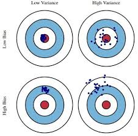

## April 10th, 2017

### Algorithms:
_Logistic Regression_  
A classification algorithm   
Output is the probability of an observation belonging to a certain class using the log-odds function.   
Pros: Interpretable, difficult to overfit

_Naive Bayes_   
Another classification algorithm.  
Assuming vector of independent features, outputs the probability of target variable belonging to a certain class using Bayes Theorem. 
See: https://en.wikipedia.org/wiki/Naive_Bayes_classifier   
Pros: Good for text, fast, scales well, doesn't overfit, and easy to interpret.   
Cons: The central assumption (that all features are independent) is usually not true in real life.

### Review:  
Precision, recall, and accuracy.   
Precision = TP/(TP + FP)    
Recall = TP/(TP + FN)    
Accuracy = what percent the algortithm correctly classified    
ROC (Receiver Operating Characteristic) - originally used in WWII to assess radar receiver operators on their ability to differentiate signal. 

_Bias variance tradeoff_
Bias = difference between your model output and the correct outcome   
Low bias = your prediction is good = but could be overfit   
High bias = your prediction is off = could be underfit   

Variance = variability of prediction for a given set of training data   
High variance = overfit    
Low variance = underfit    

Some useful diagrams:   
   

